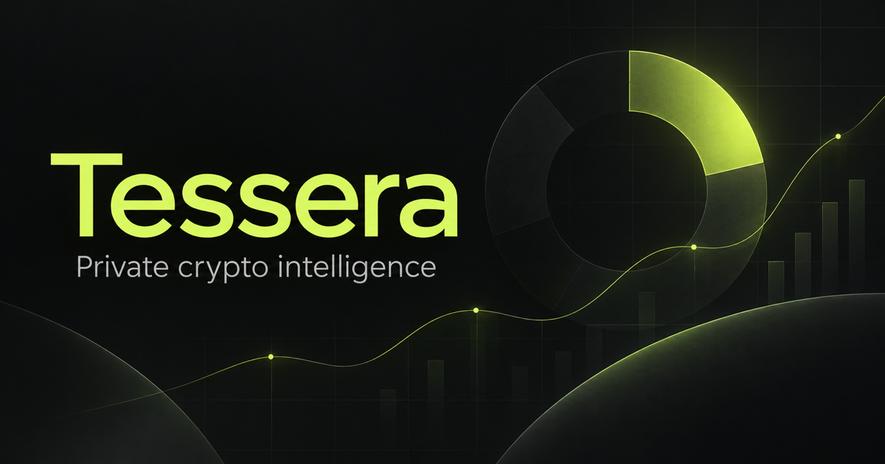

# Tessera

Tessera is a local-first portfolio dashboard for crypto, stocks, staked assets, and perpetual futures. It combines manual positions, wallet snapshots, live market prices, venue risk, target scenarios, equity history, and P&L analytics in one interface.



## Highlights

- Spot crypto, stocks, ETFs, staked assets, and leveraged perpetual positions
- Hyperliquid and Lighter wallet snapshots, including staking and open perps
- Solana, EVM, and Robinhood Chain wallet imports
- Screenshot OCR imports with editable review before saving
- Saved import profiles that own their positions and can be renamed or removed
- Live crypto and stock pricing with provider fallbacks
- Portfolio equity, exposure, margin, leverage, liquidation, and platform analytics
- Historical equity and cumulative venue P&L charts with persistent custom ranges
- Price targets, target-value modeling, position adjustments, and a configurable dust cutoff
- Light and dark themes
- Browser-local persistence with JSON backup and restore

## Privacy model

Tessera does not require a database or account. Portfolio state and import profiles are stored in the browser's local storage. Wallet imports use public, read-only endpoints and are saved as one-time snapshots; the app never requests a seed phrase, private key, or transaction signature.

Use **Settings → Export backup** before clearing browser data or moving to another browser.

## Requirements

- Node.js 22.13 or newer
- npm
- Internet access for live prices and public wallet APIs

## Start locally

```bash
git clone https://github.com/runsoliv/tessera-portfolio.git
cd tessera-portfolio
npm install
npm run dev
```

Open [http://localhost:3000](http://localhost:3000).

Stop the server with `Ctrl+C`. Your saved portfolio remains in browser storage when the server is stopped.

## Supported imports

### Wallets

- Hyperliquid: spot balances, open perpetuals, delegated HYPE, staking balances, and pending withdrawals
- Lighter: account assets, open perpetuals, staked LIT pool shares, and pending unlocks
- Solana: native SOL, SPL tokens, and Token-2022 balances
- EVM: Ethereum, Base, Arbitrum, Optimism, Polygon, Gnosis, and Celo
- Robinhood Chain stock tokens

Wallet imports are not live account connections. Re-import a wallet when you want to take a new snapshot.

### Screenshots

Screenshot parsing runs locally with Tesseract.js. Detected tickers, quantities, platforms, position types, and leverage are shown for review before anything is added. Imported assets are linked to live market pricing when a matching crypto or stock ticker can be resolved.

## Market-data notes

The dashboard uses multiple public providers, including CoinGecko, DEX Screener, Hyperliquid, Lighter, Jupiter, Blockscout, Robinhood Chain, and public stock quote endpoints. Availability and rate limits are controlled by those providers. Cached prices remain visible when a refresh temporarily fails.

Lighter does not expose complete historical equity and P&L for every standard account through its public endpoints. Local snapshots continue tracking those accounts after import.

## Commands

```bash
npm run dev      # local development server
npm run lint     # source checks
npm run format   # format source files
npm run build    # production build
npm run start    # serve the production worker build locally
```

## Data disclaimer

Tessera is a personal tracking and analysis tool. Values, liquidation estimates, market prices, and P&L calculations may be delayed or incomplete and should not be treated as financial, tax, or trading advice.
